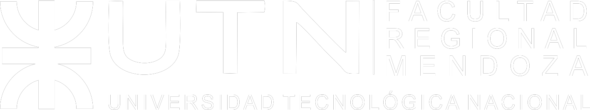

- Proyecto para la Cátedra Redes Neuronales Profundas  
- Profesor: Pablo Marinozi  
- **UTN FRM 2024**

# Transformación de Imágenes: De Día a Noche

Este proyecto utiliza **Streamlit** para proporcionar una interfaz interactiva que convierte imágenes diurnas en nocturnas mediante un modelo de Deep Learning basado en **UNet**. Se entrena un decoder utilizando un encoder **ResNet50** preentrenado. A continuación, encontrarás los pasos para clonar el repositorio, instalar las dependencias y ejecutar la aplicación.

---

## Resumen del Proyecto

El objetivo principal de este proyecto es transformar imágenes capturadas durante el día en representaciones realistas de escenas nocturnas. 

### Dataset Utilizado
- [CARLA Paired Images Dataset](https://www.kaggle.com/datasets/okarif/carla-parired-images?select=data_carla)

### Metodología
1. **Preprocesamiento de datos**:
   - Las imágenes se redimensionan a **224x224 píxeles**.
   - Se normalizan utilizando los pesos de la **ResNet50** preentrenada.
   - Los valores de los píxeles se reducen entre 0 y 1 dividiéndolos por 255.

2. **Modelo de Aprendizaje Profundo**:
   - **UNet**: 
     - **Encoder**: ResNet50 preentrenada.
     - **Decoder**: Diseñado a medida, incluyendo conexiones residuales.
   - Entrenado durante **60 epochs** para lograr una alta fidelidad en la conversión.

3. **Aplicación Interactiva**:
   - Los usuarios pueden cargar imágenes diurnas y obtener versiones nocturnas directamente desde la interfaz de **Streamlit**.


## Instalación y Uso

### 1. Clonar el Repositorio

Clona este repositorio utilizando el siguiente comando:
```bash
git clone https://github.com/fernandezlautt/global_dnn.git
cd global_dnn
```

### 2. Crear y Activar un Entorno Virtual

Es recomendable utilizar un entorno virtual para gestionar las dependencias del proyecto:
```bash
# Crear un entorno virtual
python -m venv venv

# Activar el entorno virtual

# En Windows:
venv\Scripts\activate
# En macOS/Linux:
source venv/bin/activate
```

### 3. Instalar Dependencias

Ejecuta el siguiente comando para instalar todas las dependencias necesarias:
```bash
pip install -r requirements.txt
```

### 4. Ejecutar la Aplicación

Para iniciar la aplicación de **Streamlit**, utiliza el comando:
```bash
streamlit run app.py
```

Esto abrirá la aplicación en tu navegador predeterminado en la dirección `http://localhost:8501`.

---

## Estructura del Proyecto

```
global_dnn/
│
├── data/                 # Contiene el dataset
│
├── dev/                  # Archivos para desarrollo y pruebas
│   ├── global.html       # Archivo HTML de pruebas
│   ├── global.ipynb      # Notebook con pruebas de datos
│   ├── Resize_Dataset.ipynb # Notebook para redimensionar el dataset
│   ├── unet_18.py        # UNet con ResNet18
│   ├── unet_50.py        # UNet con ResNet50
│   └── utils.py          # Funciones auxiliares
│
├── prod/                 # Archivos para producción
│   ├── app.py            # Aplicación principal de Streamlit
│   ├── model_25_normalized.pt # Modelo entrenado con 25 épocas
│   ├── model_50_res_35.pt # Modelo con ResNet50 y 35 épocas
│   ├── model_50_res_45.pt # Modelo con ResNet50 y 45 épocas
│   ├── model_50_res_60.pt # Modelo con ResNet50 y 60 épocas
│   ├── unet_18.py        # UNet con ResNet18 (en producción)
│   ├── unet_50.py        # UNet con ResNet50 (en producción)
│   ├── utils.py          # Funciones para producción
│   └── requirements.py   # Dependencias para producción
│
└── README.md             # Este archivo


```

## Recursos Adicionales

- **Dataset**: [CARLA Paired Images Dataset](https://www.kaggle.com/datasets/okarif/carla-parired-images?select=data_carla)
- **Documentación**:
  - [Streamlit](https://docs.streamlit.io/)
  - [ResNet50 en Pytorch](https://pytorch.org/vision/0.18/models/generated/torchvision.models.resnet50.html)
  - [UNet Architecture](https://arxiv.org/abs/1505.04597)

## Autores

- [Lautaro Fernandez](https://www.linkedin.com/in/lautaro-fernandez-b4535a1b8/) 
- [Carlos Moreno](https://www.linkedin.com/in/carlos-alejandro-moreno/)
